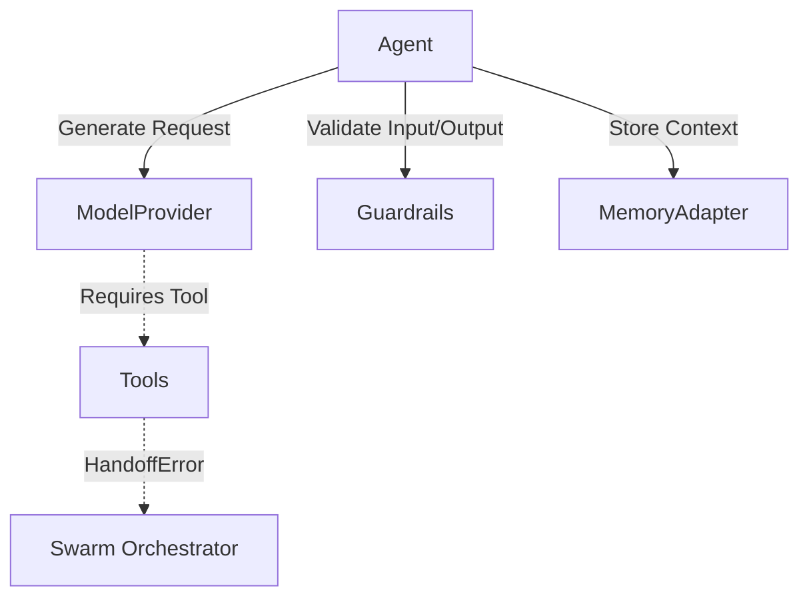

# DevSDK

[](https://www.npmjs.com/package/devsdk-core)
[](https://dev-sdk.vercel.app/)

A lightweight TypeScript framework for building and orchestrating LLM agents. It provides native support for swarms, structured outputs, and human-in-the-loop guardrails without enforcing heavy abstractions.

**[Read the Full Documentation](https://dev-sdk.vercel.app/)**
**[View on NPM](https://www.npmjs.com/package/devsdk-core)**

---

## Features

- **Multi-Agent Swarms:** Safely transfer context between specialized agents using native error boundaries.
- **Structured Outputs:** Enforce strict JSON responses natively using Zod schemas.
- **Reliable by Default:** Built-in exponential backoff and timeout handling for provider calls.
- **Tool Guardrails:** Pause execution and require human approval for sensitive actions.
- **Granular Tracing:** Subscribe to lifecycle events for logging and streaming.

## Installation

```bash
npm install devsdk-core openai zod
```

## Quick Start

```typescript
import { z } from "zod";
import { Agent, OpenAIProvider, createTool } from "devsdk-core";

const provider = new OpenAIProvider({ apiKey: process.env.OPENAI_API_KEY });

const getWeather = createTool(
  "get_weather",
  "Get the current weather",
  z.object({ location: z.string() }),
  async ({ location }) => ({ temp: 72, condition: "Sunny", location })
);

const agent = new Agent({
  name: "WeatherBot",
  instructions: "You are a helpful weather assistant.",
  provider,
  tools: [getWeather]
});

async function main() {
  const answer = await agent.run("What is the weather in San Francisco?");
  console.log(answer); 
}

main();
```

## Architecture

DevSDK is designed to be completely modular. You can mix and match providers, memory adapters, and tools.



## Examples

We provide ready-to-run examples in the `examples/` directory to help you get started with advanced use cases:

- **`structured-output.ts`**: Demonstrates how to strictly enforce Zod JSON schemas for extraction tasks.
- **`swarm-handoff.ts`**: Demonstrates how to create multiple specialized agents and orchestrate seamless context handoffs between them.

## Supported Providers

DevSDK uses an abstract `ModelProvider` interface, meaning you can plug in any LLM provider easily.

| Provider | Status | Package |
| :--- | :--- | :--- |
| **OpenAI** | ✅ Built-in | `OpenAIProvider` |
| **Custom** | ✅ Supported | Implement `ModelProvider` |

---
<br/>
<p align="center">
  made with love ❤️ <b>Jaani</b>
</p>
